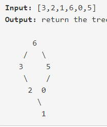

# leetcode刷题笔记

## 157. Maximum Binary Tree

### 题目：

根据数组生成一个数据结构，这个数据结构的定义是: 将数组中的最大值作为根节点，然后按照该值的位置将数组左右分为左子树和右子树：



### 提交代码：

关键字：前序递归遍历

思路：采用二叉树前序递归遍历的思想，首先找到当前的最大值，将其设置为根，然后再构建左子树和右子树。

    TreeNode* help(vector<int>& nums, int left, int right) {
        if(left > right) return nullptr;
        if(left == right) return new TreeNode(nums[left]);typo
        int max_id = left;
        int max_tmp = nums[left];
        for(int i=left+1; i<=right; i++) {
            if(nums[i] > max_tmp){
                max_tmp = nums[i];
                max_id = i;
            }
        }
        TreeNode* node = new TreeNode(max_tmp);
        node->left = help(nums, left, max_id - 1);
        node->right = help(nums, max_id + 1, right);
        return node;
    }
    TreeNode* constructMaximumBinaryTree(vector<int>& nums) {
        return help(nums,0,nums.size()-1);
    }
### 复杂度分析：

时间复杂度：推理公式是这样的：
$$
T(n) = 2*T(n/2) + o(n)
$$
这样得到的时间复杂度表达式是
$$
o(n*lg(n))
$$
空间复杂度：主要是构建的数据结构占据的空间为o(n),

分析冗余思想：这里的冗余主要在院寻找最大值时每次都需要遍历当前区间所有的值，每次遍历是冗余的。因此改进的方向在于将每次递归中的线性比较时间变为常数时间。

### 别人代码与分析：

```
TreeNode* constructMaximumBinaryTree(vector<int>& nums) {
        vector<TreeNode*> stk;
        for (int i = 0; i < nums.size(); ++i)
        {
            TreeNode* cur = new TreeNode(nums[i]);
            while (!stk.empty() && stk.back()->val < nums[i])
            {
                cur->left = stk.back();
                stk.pop_back();
            }
            if (!stk.empty())
                stk.back()->right = cur;
            stk.push_back(cur);
        }
        return stk.front();
    }
```

思路：遍历一遍，每次遇到新的数字时，对当前堆进行调整

## Maximum Width of Binary Tree

### 题目

找出二叉树的最大宽度

### 提交代码

```
map<TreeNode*, int> indexOfTree;
void setIndexOfTree(TreeNode* root, int index) {
    if(root == nullptr) return;
    indexOfTree.insert(make_pair(root,index));
    setIndexOfTree(root->left, index*2);
    setIndexOfTree(root->right, index*2+1);
}
int widthOfBinaryTree(TreeNode* root) {
    setIndexOfTree(root, 1);
    queue<TreeNode*> q;
    q.push(root);
    int res = 1;
    while(!q.empty()) {
        int size = q.size();
        int left = indexOfTree.find(q.front())->second;
        int right;
        TreeNode * tmpNode;
        while(size--) {
            tmpNode = q.front();
            q.pop();
            right = indexOfTree.find(tmpNode)->second;
            if(tmpNode -> left != NULL) q.push(tmpNode->left);
            if(tmpNode -> right != NULL) q.push(tmpNode->right);
        }
        res = max(res, right - left + 1);
    }
    return res;
}
```


### 思路与复杂度分析

主要思路是利用数组实现树的思想时，对二叉树中的节点的位置进行记录，然后进行层级遍历。

题目的缺陷在于使用了两种方式对二叉树进行遍历，相当于遍历了两遍二叉树，主要修正思路是将两种遍历结合。

时间复杂度：o(n)；

空间复杂度：o(1)

那么重点就在于如何将使用前序遍历的思想得到当前level的宽度

### 别人的代码与分析

```
int widthOfBinaryTree(TreeNode* root) {
        return dfs(root, 0, 1, vector<pair<int, int>>() = {});
    }
    
    int dfs(TreeNode* root, int level, int order, vector<pair<int, int>>& vec){
        if(root == NULL)return 0;
        if(vec.size() == level)vec.push_back({order, order});
        else vec[level].second = order;
        return max({vec[level].second - vec[level].first + 1, dfs(root->left, level + 1, 2*order, vec), dfs(root->right, level + 1, 2*order + 1, vec)});
    }
```

## 542. 01Matrix

### 题目

给定一个只含有0,1的矩阵，求解每个为1的数字躲在的位置到最近的0的距离。

### 提交代码

```
int n, m;
int get_dis(vector<vector<int>>res, vector<vector<bool>> is_visible, vector<vector<int>>& matrix, int i, int j) {
if (matrix[i][j] == 0) return 0;
if (is_visible[i][j]) return res[i][j];
is_visible[i][j] = true;
int tmp = 100001;
if (i + 1 < n) tmp = fmin(tmp, get_dis(res, is_visible, matrix, i + 1, j));
if (i - 1 >= 0) tmp = fmin(tmp, get_dis(res, is_visible, matrix, i - 1, j));
if (j + 1 < m) tmp = fmin(tmp, get_dis(res, is_visible, matrix, i, j + 1));
if (j - 1 >= 0) tmp = fmin(tmp, get_dis(res, is_visible, matrix, i, j - 1));
return tmp + 1;

}
vector<vector<int>> updateMatrix1(vector<vector<int>>& matrix) {

n = matrix.size();
m = matrix[0].size();
vector<vector<int>> res(n, vector<int>(m, 0));
vector<vector<bool>> is_visible(n, vector<bool>(m, false));
for (int i = 0; i<n; i++) {
	for (int j = 0; j<m; j++) {
		res[i][j] = get_dis(res, is_visible, matrix, i, j);
	}
}
return res;
}
```

### 错误解析

这道题目不能够用深度优先遍历，因为会导致两个状态之间的互相利用，从而陷入死锁。。。因此可以采用宽度优先遍历的思想。

### 正确代码

```
vector<vector<int>> updateMatrix(vector<vector<int>>& matrix) {

    queue<pair<int,int>*> q;
    int n = matrix.size();
    int m = matrix[0].size();
    for(int i=0; i<n; i++) {
        for(int j=0; j<m; j++) {
            if(matrix[i][j] == 0) q.push(new pair<int,int>(i,j));
            else matrix[i][j] = INT_MAX;
        }
    }
    while(!q.empty()) {
        pair<int,int>* tmp = q.front();
        q.pop();
        int i = tmp->first;
        int j = tmp->second;
        if (i + 1 < n && matrix[i+1][j] > matrix[i][j] + 1) {
            matrix[i+1][j] = matrix[i][j] + 1; 
            q.push(new pair<int,int>(i+1,j));
        }
        if (i - 1 >= 0 && matrix[i-1][j] > matrix[i][j]  + 1) {
            matrix[i-1][j] = matrix[i][j] + 1;
            q.push(new pair<int,int>(i-1,j));
        }
 	    if (j + 1 < m && matrix[i][j+1] > matrix[i][j] + 1) {

            matrix[i][j+1] = matrix[i][j] + 1;
            q.push(new pair<int,int>(i,j+1));
        }
        if (j - 1 >= 0 && matrix[i][j-1] > matrix[i][j] + 1) {
            matrix[i][j-1] = matrix[i][j] + 1;
            q.push(new pair<int,int>(i,j-1));
        }
    }
    return matrix;
}
```

### 复杂度分析

时间复杂度为o(n)，空间复杂度为o(1).